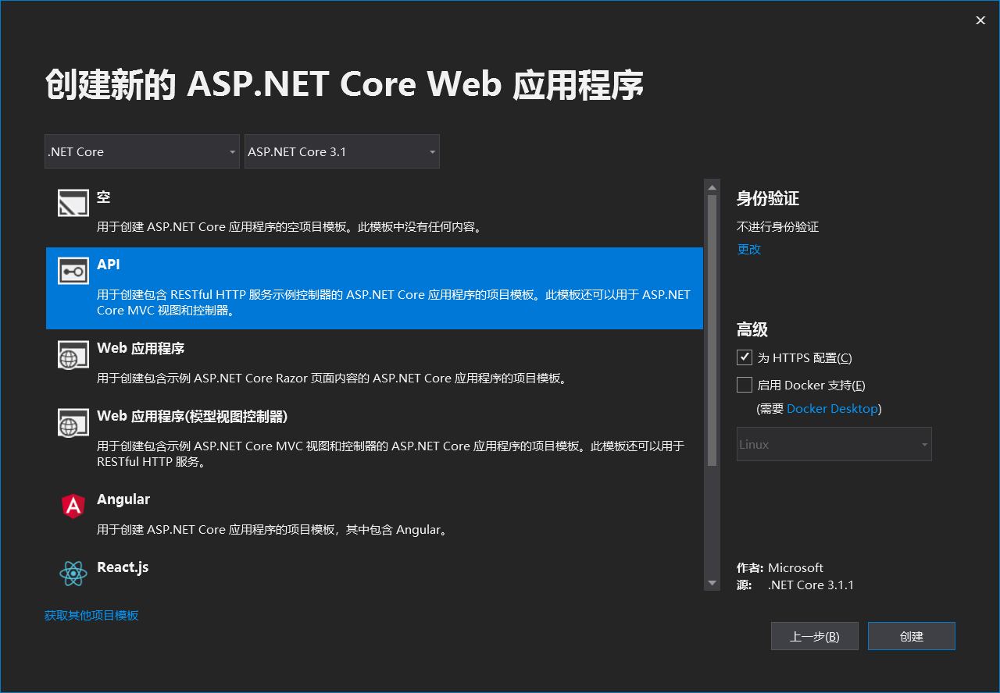
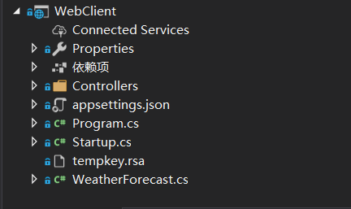
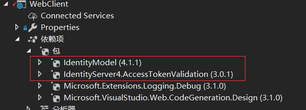
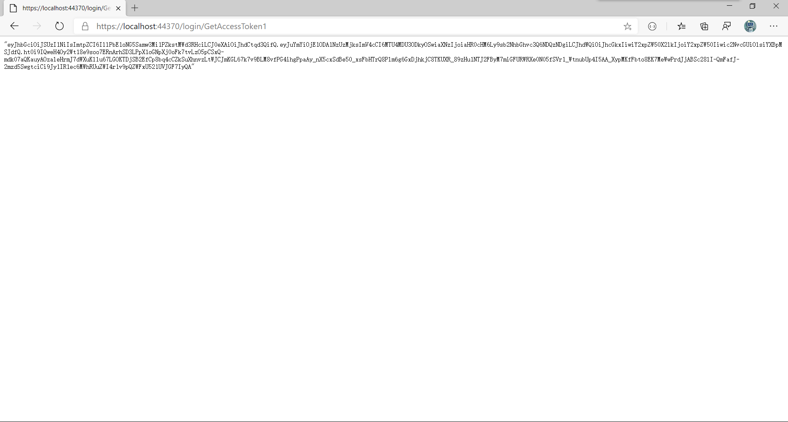
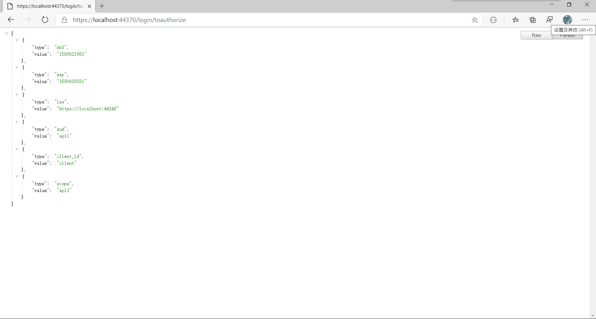

# 1. 获取AccessToken

在向资源服务器请求时,需要带上AccessToken.

在这篇文章中我们将基于前面的授权服务器,获取AccessToken,并访问API资源.

## 1.1. 导航
<!-- TOC -->

- [1. 获取AccessToken](#1-获取accesstoken)
    - [1.1. 导航](#11-导航)
    - [1.2. 创建一个WEB项目](#12-创建一个web项目)
    - [1.3. Startup中添加中间件与开启服务](#13-startup中添加中间件与开启服务)
    - [1.4. 获取AccessToken](#14-获取accesstoken)
    - [1.5. 通过AccessToken去获取Api资源](#15-通过accesstoken去获取api资源)
    - [1.6. 总结](#16-总结)

<!-- /TOC -->

## 1.2. 创建一个WEB项目

这里我的SDK已经更新为3.1,所以我创建了一个asp.net core 3.1的web应用程序,名称为webclient.配置如下图:



创建完成后项目目录如下:



通过Nuget安装两个包:



IdentithyModel:主要用于请求授权服务器,这个包已经封装好基础API开箱即食十分舒服.

identityserver4.accesstokenvalidation:则用于校验Accesstoken.

到此步,就已经完成基础准备.

## 1.3. Startup中添加中间件与开启服务

```c#

public void ConfigureServices(IServiceCollection services)
{
    services.AddMvcCore(option => option.EnableEndpointRouting = false)
        .AddAuthorization();
    services.AddAuthentication("Bearer").AddJwtBearer("Bearer", option =>
    {
        option.Authority = "https://localhost:44348/";
        //要跟Client的Scope一致
        option.Audience = "api1";
    });
    services.AddControllersWithViews();
}
// This method gets called by the runtime. Use this method to configure the HTTP request pipeline.
public void Configure(IApplicationBuilder app, IWebHostEnvironment env)
{
    if (env.IsDevelopment())
    {
        app.UseDeveloperExceptionPage();
    }
    //app.UseIdentityServer();
    app.UseHttpsRedirection();
    app.UseRouting();
    app.UseAuthentication();
    app.UseAuthorization();
    app.UseEndpoints(endpoints =>
    {
        endpoints.MapDefaultControllerRoute();
    });
    app.UseMvc(routes =>
    {
        routes.MapRoute("default", "{controller=Home}/{action=Index}/{id?}");
    });
}
```

## 1.4. 获取AccessToken

新建一个控制器LoginController.里面有一个获取AccessToken的函数

```c#

/// <summary>
/// 获取accessToken 的方法1
/// 普通获取方式.
/// </summary>
/// <returns></returns>
public async Task<IActionResult> GetAccessToken1()
{
    var client = new HttpClient();
    var disco = await client.GetDiscoveryDocumentAsync("https://localhost:44348/");
    var tokenResponse = await client.RequestClientCredentialsTokenAsync(new ClientCredentialsTokenRequest
    {
        Address = disco.TokenEndpoint,
        ClientId = "client",
        ClientSecret = "secret",
        Scope = "api1"
    });
    return new JsonResult(tokenResponse.AccessToken);
}

```

获取AccessToken的另一种方法.

```c#
/// <summary>
/// 获取accessToken的方法2
/// 使用TokenClient获取
/// </summary>
/// <returns></returns>
public async Task<IActionResult> GetAccessToken2()
{
    var client = new HttpClient();
    var disco = await client.GetDiscoveryDocumentAsync("https://localhost:44348/");
    //var tokenEndpoint = disco.TokenEndpoint;
    //var keys = disco.KeySet.Keys;
    var tokenClient = new TokenClient(client, new TokenClientOptions
    {
        ClientId = "client",
        Address = disco.TokenEndpoint,
        ClientSecret = "secret"
    });
    var tokenResponse = await tokenClient.RequestClientCredentialsTokenAsync("api1");
    return new JsonResult(tokenResponse.AccessToken);
}
```

运行授权服务器(DemoA)和WebClient.然后访问GetAccessToken1如图:



## 1.5. 通过AccessToken去获取Api资源

新建一个资源控制器AccessController

```c#
[Authorize]
public class AccessController : Controller
{
    public IActionResult GetUserInfo()
    {
        var claims = from c in User.Claims select new { c.Type, c.Value };
        return new JsonResult(claims);
    }
}
```

在Login控制器下新添一个函数

```c#
/// <summary>
/// 访问带有访问限制的接口
/// </summary>
/// <returns></returns>
public async Task<IActionResult> ToAuthorize()
{
    var client = new HttpClient();
    var disco = await client.GetDiscoveryDocumentAsync("https://localhost:44348/");
    var tokenClient = new TokenClient(client, new TokenClientOptions
    {
        ClientId = "client",
        Address = disco.TokenEndpoint,
        ClientSecret = "secret"
    });
    var tokenResponse = await tokenClient.RequestClientCredentialsTokenAsync("api1");
    var apiclient = new HttpClient();
    apiclient.SetBearerToken(tokenResponse.AccessToken);
    var apiResponse = await apiclient.GetAsync("https://localhost:44370/access/getuserinfo");
    var str = await apiResponse.Content.ReadAsStringAsync();
    //用于反序列化匿名类型的json字符串.
    var definition = new[] { new { Type = "0", Value = "" } };
    var obj = Newtonsoft.Json.JsonConvert.DeserializeAnonymousType(str, definition);
    return new JsonResult(obj);
}
```
访问的结果



## 1.6. 总结

1. 仔细看看请求时要与授权服务器中BaseConfig中ClientId,Scope的名称还有加密串ClientSecrets的配置要一致.
