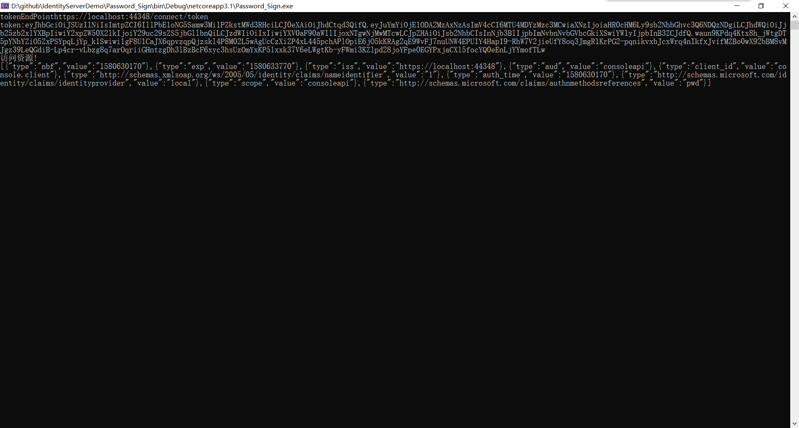

# 1. ResourceOwnerPassword

会把密码直接暴露到第三方,不建议使用.主要用于项目与授权服务器仍然一体,或者历史遗留项目.

## 1.1. 导航

## 使用控制台客户端访问WebClient资源

首先是新建一个控制台项目Password_Sign,主要也要是 core 3.1 的程序.

获取AccessToken的方法与上一篇文章的方式一致.这里封装成几个方法方便调用.

```c#
/// <summary>
/// 用Password获取AccessToken
/// </summary>
/// <param name="client"></param>
/// <param name="disco"></param>
/// <returns></returns>
private static async Task<TokenResponse> RequestToken(HttpClient client, DiscoveryDocumentResponse disco)
{
    var tokenClient = new TokenClient(client, new TokenClientOptions
    {
        Address = disco.TokenEndpoint,
        ClientId = "console.client",
        ClientSecret = "secret"
    });
    var tokenResponse = await tokenClient.RequestPasswordTokenAsync("test1", "123456", "consoleapi");
    return tokenResponse;
}
```

> 这里要注意上面scope是"consoleapi",在WebClient的Startup中的代码要修改一下

```c#
 services.AddAuthentication("Bearer").AddJwtBearer("Bearer", option =>
            {
                option.Authority = "https://localhost:44348/";
                //option.RequireHttpsMetadata = false;
                //option.Audience = "api1";
                option.Audience = "consoleapi";

            });
```
## 访问API资源

```c#
/// 获取API资源
/// </summary>
/// <param name="tokenResponse"></param>
/// <returns></returns>
private static async Task GetApiResourc(TokenResponse tokenResponse)
{
    var apiclient = new HttpClient();
    apiclient.SetBearerToken(tokenResponse.AccessToken);
    var apiResponse = await apiclient.GetAsync("https://localhost:44370/access/getuserinfo");
    var str = await apiResponse.Content.ReadAsStringAsync();
    Console.WriteLine(str);
}
```

```c#
private static async Task 获取API资源DEMO(HttpClient client,DiscoveryDocumentResponse disco)
{
    TokenResponse tokenResponse = await RequestToken(client, disco);
    //第二种方式
    //TokenResponse tokenResponse =  await RequestToken2(client, disco);
    if (tokenResponse.IsError)
    {
        Console.WriteLine("error:" + tokenResponse.Error);
    }
    else
    {
        Console.WriteLine("token:" + tokenResponse.AccessToken);
    }
    Console.WriteLine("访问资源!");
    //获取API资源
    await GetApiResource(tokenResponse);
}
```

最后在入口Main函数里调用

```c#
static async Task Main(string[] args)
{
    var client = new HttpClient();
    var disco = await client.GetDiscoveryDocumentAsync("https://localhost:44348");
    if (disco.IsError)
    {
        Console.WriteLine("error:" + disco.Exception.Message);
    }
    else
    {
        Console.WriteLine("tokenEndPoint" + disco.TokenEndpoint);
    }
    await 获取API资源DEMO(client, disco);
    //await 获取IdentityAPI资源DEMO(client, disco);
    Console.ReadKey();
}
```

运行最后结果:



加上这个项目,一个简单的解决方案就完成了.
控制台客户端获取授权服务器颁发的AccessToken后,然后携带着AccessToken去访问WebClient(资源服务器)的接口,获取用户信息.

流程如下图:
