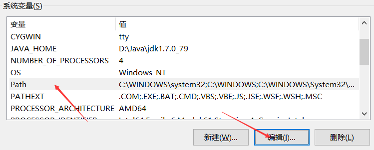
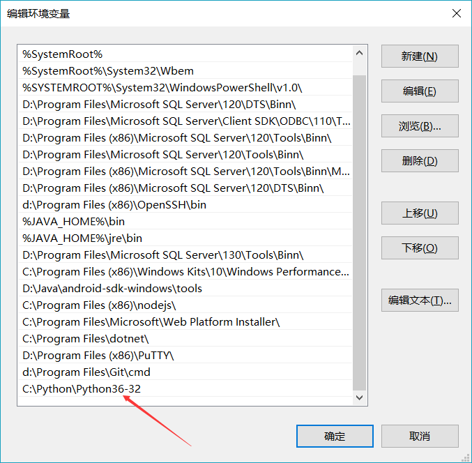

# 环境变量
## 搭建windows环境
1. 版本Python 3.6.2,[下载](https://www.python.org/downloads/).
2. 安装后配置环境变量.
> 我的系统是win10,如果是其他操作系统可能会有点不一样.


> 新建立一个环境变量


3. 重启后配置即生效.
## 使用VSCode开发Python
本人使用VSCode编辑器学习Python,所以直接在插件查找Python安装即可.
## Hello World
> 欢迎来到新世界

> 在VSCode 新建一个后缀名为py的文件.输入下面的代码
```Python
print("Hello World");
```
> 然后按下F5就进入debug了.按下继续在输出查看结果