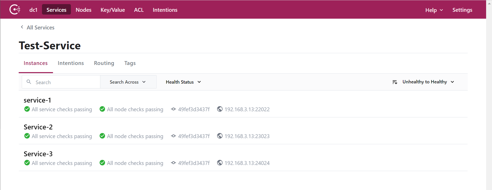
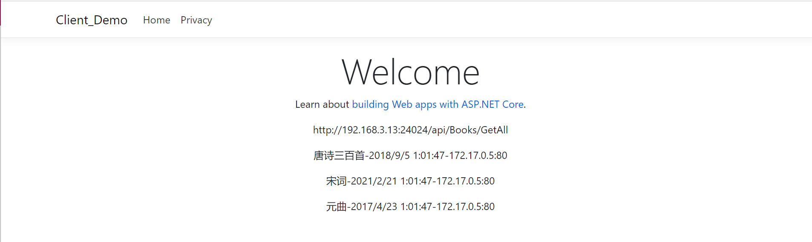

# 1. 服务注册发现(consul)

本demo的业务代码不详细讲解,需要了解请查看[github地址]("https://github.com/heweigeng1/Consul_Demo").此服务接口只是简单的提供一个查询书本列表的接口.

## 1.1. 环境

consul 1.9.5
.netcore 3.1

## 1.2. 目录

<!-- TOC -->

- [1. 服务注册发现(consul)](#1-服务注册发现consul)
  - [1.1. 环境](#11-环境)
  - [1.2. 目录](#12-目录)
  - [1.3. 安装consul](#13-安装consul)
    - [1.3.1. step1 拉取镜像](#131-step1-拉取镜像)
    - [1.3.2. step2 发布容器服务](#132-step2-发布容器服务)
  - [1.4. 注册服务](#14-注册服务)
    - [1.4.1. 发布服务注册到consul中](#141-发布服务注册到consul中)
- [2. 发现服务](#2-发现服务)

<!-- /TOC -->

## 1.3. 安装consul

这里我使用 docker 安装,主要是因为干净,不会在系统留下垃圾.

### 1.3.1. step1 拉取镜像

```shell
docker pull consul:latest
```

### 1.3.2. step2 发布容器服务

```shell
docker run -d -p 8500:8500 --name consul consul:latest
```

因为我这里是本地测试,所以输入http://localhost:8500/ 打开看看是否成功.

## 1.4. 注册服务

这里是使用 .net core项目作为服务,注册到consul中.

首先安装依赖包 Consul.我这里安装的版本是1.6.10.1

添加注册类

```c#
public static class ConsulUtils
{
    /// <summary>
    /// 服务注册到consul
    /// </summary>
    /// <param name="app"></param>
    /// <param name="lifetime"></param>
    public static IApplicationBuilder RegisterConsul(this IApplicationBuilder app, IConfiguration configuration, IHostApplicationLifetime lifetime)
    {
        var consulClient = new ConsulClient(c =>
        {
            //consul地址
            c.Address = new Uri(configuration["ConsulSetting:ConsulAddress"]);
            c.Datacenter = "dc1";
        });
        var registration = new AgentServiceRegistration()
        {
            ID = Guid.NewGuid().ToString(),//服务实例唯一标识
            Name = configuration["ConsulSetting:ServiceName"],//服务名
            Address = configuration["ConsulSetting:ServiceIP"], //服务IP
            Port = int.Parse(configuration["ConsulSetting:ServicePort"]),//服务端口 因为要运行多个实例，端口不能在appsettings.json里配置，在docker容器运行时传入
            Check = new AgentServiceCheck()
            {
                DeregisterCriticalServiceAfter = TimeSpan.FromSeconds(5),//服务启动多久后注册
                Interval = TimeSpan.FromSeconds(5),//健康检查时间间隔
                HTTP = $"http://{configuration["ConsulSetting:ServiceIP"]}:{configuration["ConsulSetting:ServicePort"]}/{configuration["ConsulSetting:ServiceHealthCheck"]}",//健康检查地址
                Timeout = TimeSpan.FromSeconds(5)//超时时间
            }
        };
        //服务注册
        consulClient.Agent.ServiceRegister(registration).Wait();
        //应用程序终止时，取消注册
        lifetime.ApplicationStopping.Register(() =>
        {
            consulClient.Agent.ServiceDeregister(registration.ID).Wait();
        });
        return app;
    }
}
```

appsettings.json中添加配置项

```json
"ConsulSetting": {
  "Id": "Service-1",//此处可以使用guid
  "ServiceName": "ConsulService",
  "ServiceIP": "192.168.3.13",
  "ServicePort": "10846",
  "ServiceHealthCheck": "healthcheck",
  "ConsulAddress": "http://192.168.3.13:8500" //注意，docker容器内部无法使用localhost访问宿主机器，如果是控制台启动的话就用localhost
}
```

在Starup启动类中添加

```c#

public void Configure(IApplicationBuilder app,IWebHostEnvironment env,IHostApplicationLifetimelifetime)
{
    if (env.IsDevelopment())
    {
        //app.UseDeveloperExceptionPage();
    }
    app.UseDeveloperExceptionPage();
    app.UseRouting();
    app.UseAuthorization();
    app.UseEndpoints(endpoints =>
    {
        endpoints.MapControllers();
    });
    //注册到consul中
    app.RegisterConsul(Configuration, lifetime);
}
```

### 1.4.1. 发布服务注册到consul中

可以在本地启动三个服务,但这里使用 docker 发布.

编译镜像
```shell
docker build -t 镜像名称 -f Dockerfile路径 .
```

启动容器服务
```shell
docker run -d -v /lcoal/appsettings.json:app/appsettings.json -p 22022:80 --name 容器 镜像名称
```

* 注意,这里映射了appsettings.json文件,每次启动容器服务前,都需要对IP或者端口进行编辑.

我这里是启动3个服务后的效果



# 2. 发现服务

1. 创建一个web项目,同样安装依赖包 Consul .

2. 添加一个操作类 **ConsulHelper**

```c#
public static class ConsulHelper
{
    public static Random random = new Random();
    public static string LookupService(string name, string url)
    {
        using ConsulClient consulClient = new ConsulClient(c => c.Address = new Uri(url));
        var services = consulClient.Catalog.Service(name).Result.Response;
        if (services.Any())
        {
            int index = random.Next(services.Count());
            var service = services.ElementAt(index);
            return $"{service.ServiceAddress}:{service.ServicePort}";
        }
        return null;
    }
}
```

3. 在你的控制器去获取接口地址并访问接口获取数据,我这里是RazorPage,但是用途跟控制器类似.

```c#
public void OnGet()
{
    string url = @$"http://{ConsulHelper.LookupService("Test-Service", "http://192.168.3.13:8500")}/api/Books/GetAll";
    Host = url;
    var callback = HttpClientUtils.Get(url);
    var obj = System.Text.Json.JsonSerializer.Deserialize<List<Book>>(callback, new System.Text.Json.JsonSerializerOptions
    {
        PropertyNameCaseInsensitive = true
    });
    Books = obj;
}
```

运行后



到这里,就基本完成了服务注册发现.