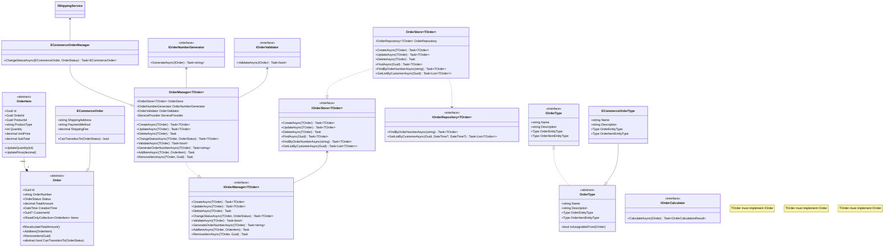

```mermaid
classDiagram
    direction BT

    class Order {
        <<abstract>>
        +Guid Id
        +string OrderNumber
        +OrderStatus Status
        +decimal TotalAmount
        +DateTime CreationTime
        +Guid? CustomerId
        +IReadOnlyCollection~OrderItem~ Items
        #RecalculateTotalAmount()
        +AddItem(OrderItem)
        +RemoveItem(Guid)
        +abstract bool CanTransitionTo(OrderStatus)
    }

    class OrderItem {
        <<abstract>>
        +Guid Id
        +Guid OrderId
        +Guid ProductId
        +string ProductType
        +int Quantity
        +decimal UnitPrice
        +decimal SubTotal
        +UpdateQuantity(int)
        +UpdatePrice(decimal)
    }

    class IOrderType {
        <<interface>>
        +string Name
        +string Description
        +Type OrderEntityType
        +Type OrderItemEntityType
    }

    class OrderType {
        <<abstract>>
        +string Name
        +string Description
        +Type OrderEntityType
        +Type OrderItemEntityType
        +bool IsAssignableFrom(IOrder)
    }

    class IOrderManager~TOrder~ {
        <<interface>>
        +CreateAsync(TOrder) Task~TOrder~
        +UpdateAsync(TOrder) Task~TOrder~
        +DeleteAsync(TOrder) Task
        +ChangeStatusAsync(TOrder, OrderStatus) Task~TOrder~
        +ValidateAsync(TOrder) Task~bool~
        +GenerateOrderNumberAsync(TOrder) Task~string~
        +AddItemAsync(TOrder, OrderItem) Task
        +RemoveItemAsync(TOrder, Guid) Task
    }

    class OrderManager~TOrder~ {
        -IOrderStore~TOrder~ OrderStore
        -IOrderNumberGenerator OrderNumberGenerator
        -IOrderValidator OrderValidator
        -IServiceProvider ServiceProvider
        +CreateAsync(TOrder) Task~TOrder~
        +UpdateAsync(TOrder) Task~TOrder~
        +DeleteAsync(TOrder) Task
        +ChangeStatusAsync(TOrder, OrderStatus) Task~TOrder~
        +ValidateAsync(TOrder) Task~bool~
        +GenerateOrderNumberAsync(TOrder) Task~string~
        +AddItemAsync(TOrder, OrderItem) Task
        +RemoveItemAsync(TOrder, Guid) Task
    }

    class IOrderStore~TOrder~ {
        <<interface>>
        +CreateAsync(TOrder) Task~TOrder~
        +UpdateAsync(TOrder) Task~TOrder~
        +DeleteAsync(TOrder) Task
        +FindAsync(Guid) Task~TOrder~
        +FindByOrderNumberAsync(string) Task~TOrder~
        +GetListByCustomerAsync(Guid) Task~List~TOrder~~
    }

    class IOrderRepository~TOrder~ {
        <<interface>>
        +FindByOrderNumberAsync(string) Task~TOrder~
        +GetListByCustomerAsync(Guid, DateTime?, DateTime?) Task~List~TOrder~~
    }

    class OrderStore~TOrder~ {
        -IOrderRepository~TOrder~ OrderRepository
        +CreateAsync(TOrder) Task~TOrder~
        +UpdateAsync(TOrder) Task~TOrder~
        +DeleteAsync(TOrder) Task
        +FindAsync(Guid) Task~TOrder~
        +FindByOrderNumberAsync(string) Task~TOrder~
        +GetListByCustomerAsync(Guid) Task~List~TOrder~~
    }

    class IOrderNumberGenerator {
        <<interface>>
        +GenerateAsync(IOrder) Task~string~
    }

    class IOrderValidator {
        <<interface>>
        +ValidateAsync(IOrder) Task~bool~
    }

    class IOrderCalculator {
        <<interface>>
        +CalculateAsync(IOrder) Task~OrderCalculationResult~
    }

    class ECommerceOrder {
        +string ShippingAddress
        +string PaymentMethod
        +decimal ShippingFee
        +CanTransitionTo(OrderStatus) bool
    }

    class ECommerceOrderType {
        +string Name
        +string Description
        +Type OrderEntityType
        +Type OrderItemEntityType
    }

    class ECommerceOrderManager {
        +ChangeStatusAsync(ECommerceOrder, OrderStatus) Task~ECommerceOrder~
    }

    Order "1" *-- "many" OrderItem
    Order <|-- ECommerceOrder
    OrderType ..|> IOrderType
    OrderType <|-- ECommerceOrderType
    IOrderManager~TOrder~ <|.. OrderManager~TOrder~
    OrderManager~TOrder~ <|-- ECommerceOrderManager
    IOrderStore~TOrder~ <|.. OrderStore~TOrder~
    IOrderRepository~TOrder~ <.. OrderStore~TOrder~
    IOrderManager~TOrder~ --> IOrderStore~TOrder~
    OrderManager~TOrder~ --> IOrderNumberGenerator
    OrderManager~TOrder~ --> IOrderValidator
    ECommerceOrderManager --> IShippingService

    note for IOrderManager~TOrder~ "TOrder must implement IOrder"
    note for IOrderStore~TOrder~ "TOrder must implement IOrder"
    note for IOrderRepository~TOrder~ "TOrder must implement IOrder"
```